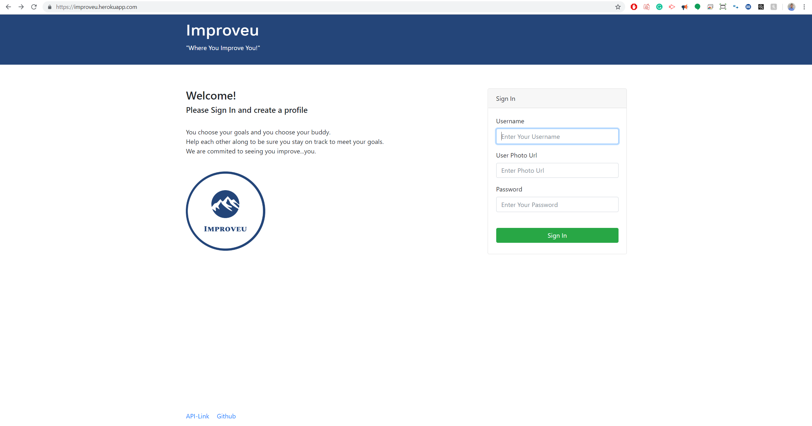
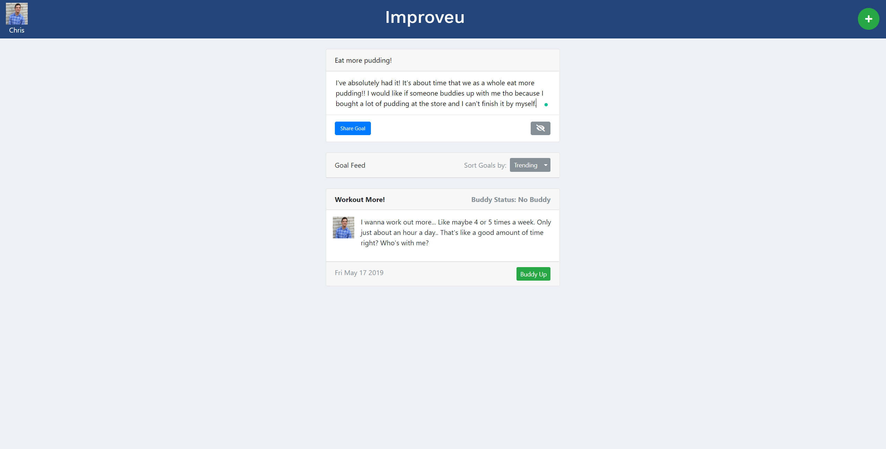

# [Improveu](https://improveu.herokuapp.com/) :runner:
Welcome to Improveu!

You choose your goals and you choose your buddy.  

Help each other along to be sure you stay on track to meet your goals.  

We are commited to seeing you improve...you.  

## Built with
* HTML5
* CSS3
* JavaScript
* jQuery
* Model View Controller (MVC)
* Object Relational Mapping (ORM)
* Express.js
    * HTTP Requests (GET, POST)
    * Routes and static content
    * Handlebars engine integration
* Node.js
    * Backend API calls
* Handlebars Templates and Layouts
* Node Package Manager (npm)
* Sequelize
* MySQL/JawsDB
* Heroku deployment

## NPM Packages: 
* [Express](https://www.npmjs.com/package/express) - Fast, unopinionated, minimalist web framework for node to handle routing.
* [Express-Handlebars](https://www.npmjs.com/package/express-handlebars) - A view engine that utilizes logicless Mustache templating language for Express that keep the view and the code separated.
* [MySQL](https://www.npmjs.com/package/mysql) - A Node.js module driver for MySQL databases.
* [Fecha](https://www.npmjs.com/package/fecha) - Lightweight date formatting and parsing (~2KB). Meant to replace parsing and formatting functionality of moment.js.
* [Sequelize](https://www.npmjs.com/package/sequelize) - Sequelize is a promise-based Node.js ORM for Postgres, MySQL, MariaDB, SQLite and Microsoft SQL Server. It features solid transaction support, relations, eager and lazy loading, read replication and more.

## Here is a preview of the app:

